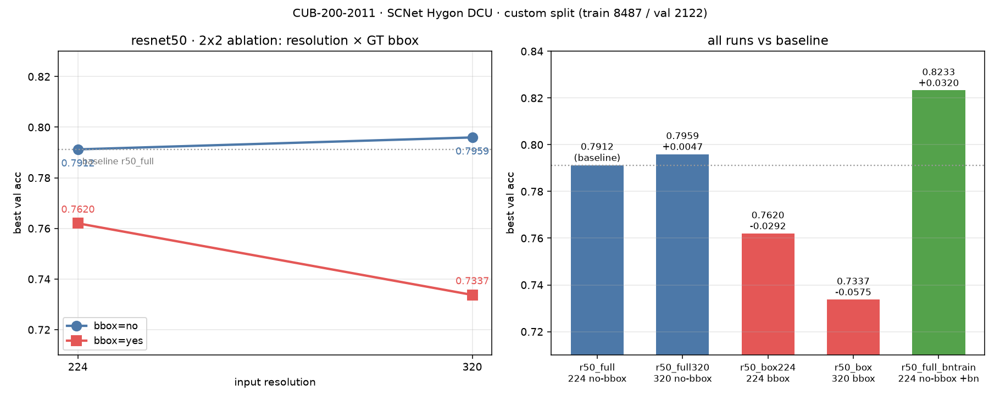

# CUB-200-2011 实验 · SCNet 郑州中心（海光 DCU）提交记录

生成时间：2026-10-01
远端工作目录：`~/cub_job/`（`/public/home/acpl6sbvpl/cub_job`）

---

## 1. 交付物

| 文件 | 说明 |
|---|---|
| `D:\A\ML\train\cub_experiments_scnet.py` | 原脚本的副本 + DCU 适配（**原 `cub_experiments.py` 未改动**） |
| `D:\A\ML\scnet_results\sbatch\*.sbatch` | Slurm 作业脚本：`01..07` 对应 7 个 example，`09` 为 r50_full 的 TTA 补跑，`10..12` 为 2×2 消融（`08` 是重训脚本，最终未提交） |
| `D:\A\ML\scnet_results\runs\` | 4 个训练 run 的 `best.pt` / `config.json` / `history.csv` |
| `D:\A\ML\scnet_results\logs\` | 全部作业的 `.out` / `.err`（含首轮失败日志） |
| `D:\A\ML\scnet_results\val_curves.png` | 4 个 run 的验证 acc / loss 曲线 |
| `D:\A\ML\scnet_results\verify_results.py` | 产物一致性校验脚本 |
| `D:\A\ML\scnet_results\plot_curves.py` | 曲线绘图脚本 |

## 2. 运行环境（集群侧）

集群上**没有 pytorch module**，`pip install torch` 装出来的是 CUDA 版，看不到 DCU。
可用的是曙光 DAS 软件栈自带的 conda 环境：

```
/public/software/sghpc_sdk/Linux_x86_64/25.6/das/conda/envs/pytorch-python3.10
  torch 2.4.1+das.opt2.dtk2504 / torchvision 0.19.1 / numpy 1.24.3
```

作业里必须先 `module load compiler/dtk/25.04`，否则 `import torch` 报
`ImportError: libgalaxyhip.so.5: cannot open shared object file`。

在其上建了一个 `--system-site-packages` 的 venv，只补装 `scikit-learn==1.5.2`：

```
~/cub_job/venv/bin/python
```

实际加速卡：`backend=dcu stack=DTK/HIP name=BW mem=64.0GiB count=1`。

## 3. 脚本改造点

1. **device 选择适配异构加速卡**
   - 新增 `available_backends()` / `select_device()` / `describe_device()`。
   - 海光 DCU 走 DTK/ROCm 构建的 torch，表现为 `torch.cuda.is_available() == True`
     且 `torch.version.hip` 非空 —— 判定为 `dcu` 而不是含糊的 `cuda`。
   - 优先级 DCU/CUDA > XPU > CPU；新增 `--device {auto,dcu,cuda,xpu,cpu}` 和 `--device-info`。
2. **离线预训练权重兜底**：新增 `build_pretrained_model()`，权重不在 torch hub 缓存里时
   直接打印缺失文件路径与预取命令，而不是抛裸 DNS 异常。
3. `pin_memory` 跟随设备；补 `torch.cuda.manual_seed_all()`。
4. `--data-root` / `--out-root` 默认走 `$CUB_DATA_ROOT` / `$CUB_OUT_ROOT`（集群布局）。
5. 训练 run 的 `config.json` 里新增记录 `"device": "dcu"`。

## 4. 作业清单与结果

第二轮（最终有效）提交：

| # | example | JobID | 状态 | 耗时 | 结果 |
|---|---|---|---:|---:|---|
| 1 | `--audit` | 875534 | COMPLETED | 0:33 | train=8487 val=2122 holdout=1179 |
| 2 | `--model resnet18 --size 224 --run r18_full` | 875576 | COMPLETED | 5:45 | best epoch=25, val acc **0.70075** |
| 3 | `--model resnet18 --size 224 --bbox --run r18_box` | 875577 | COMPLETED | 5:28 | best epoch=22, val acc **0.69463** |
| 4 | `--model resnet50 --size 224 --run r50_full` | 875578 | COMPLETED | 9:45 | best epoch=19, val acc **0.79123**（patience 触发，第 25 epoch 停止） |
| 5 | `--model resnet50 --size 320 --bbox --run r50_box` | 875579 | COMPLETED | 7:17 | best epoch=5, val acc **0.73374**（早停） |
| 6 | `… r50_box --eval-only --subset val --tta` | 875580 | COMPLETED | 0:41 | val n=2122 tta=True loss=1.0691 acc **0.74081** |
| 7 | `--eval-only --legacy-state-dict --checkpoint model/best_model.pth --tta` | 875544 | COMPLETED | 1:09 | val n=2122 tta=True loss=0.8763 acc **0.77615** |
| 8 | `… r50_full --eval-only --subset val --tta`（补跑） | 875613 | COMPLETED | 0:38 | val n=2122 tta=True loss=1.3388 acc **0.79689** |
| 9 | `r50_full + --bn-train` | 875625 | COMPLETED | 8:33 | best epoch=16, val acc **0.82328**（早停） |
| 10 | `--model resnet50 --size 320 --run r50_full320` | 875626 | COMPLETED | 14:05 | best epoch=18, val acc **0.79595**（早停） |
| 11 | `--model resnet50 --size 224 --bbox --run r50_box224` | 875627 | COMPLETED | 9:13 | best epoch=19, val acc **0.76202**（早停） |

全部 `ExitCode=0:0`。作业 6 用 `--dependency=afterany:875579` 挂在作业 5 后面。

> 注：所有 example 的语义参数（model/size/bbox/run/eval-only/subset/tta）与原脚本 docstring
> 完全一致，仅额外加了 `--workers 8`（训练）/`--workers 4`（评估）以启用多进程数据加载。

### 首轮失败（已修复，日志保留在 `logs/` 中）

`875539`~`875543` 5 个作业失败，根因是**计算节点没有外网**：

```
socket.gaierror: [Errno -2] Name or service not known
  ... torchvision/models/_api.py -> load_state_dict_from_url
```

torchvision 在作业里现下 ImageNet 预训练权重，DNS 直接失败。修复方式是在**登录节点**
预取到共享的 torch hub 缓存（`~/.cache/torch/hub/checkpoints/`），作业脚本里显式
`export TORCH_HOME="$HOME/.cache/torch"`。

登录节点上用 Python 下载还需 `export SSL_CERT_FILE=/etc/pki/tls/certs/ca-bundle.crt`，
否则报 `CERTIFICATE_VERIFY_FAILED`（`curl` 不需要这个）。已缓存：
`resnet18-f37072fd.pth`、`resnet50-11ad3fa6.pth`、`convnext_tiny-983f1562.pth`。

## 5. 其它踩到的坑

- **`--mem` 受 `DefMemPerCPU=3800MB` 约束**：`mem / cpus-per-task` 不得超过 3800MB，否则
  sbatch 直接拒收（`too much memory was requested relative to the number of CPUs`）。
  可用组合：`cpus=4/mem=12G`、`cpus=8/mem=24G`、`cpus=16/mem=56G`。
  `cpus=4/mem=16G` 会被拒。
- **QoS 虽然标 `MaxJobsPU=1`，实测 4 个作业可并行**跑在不同节点上，不必手工串行排队。
- `--gres=dcu:1` 仍是硬性要求（纯 CPU 作业被 QoS 拒绝）。

## 6. split 归属确认（重要）

脚本默认 `--split-file` 是 **用户自定义** 的 `train_test_split_0to1_1to9.txt`，不是 CUB 官方协议。

| 文件 | sha256 | 用途 |
|---|---|---|
| `train_test_split_0to1_1to9.txt`（2026-10-01 14:25） | `3a67f959ae5617be182e0c7c6c9343663e223df7816b6ac71cfa8bbfe9126c6a` | **4 个 run 全部使用**（见各自 `config.json` 的 `split_hash`） |
| `train_test_split.txt`（CUB 官方，2011） | `8bbbfcc09b4d3c9c6e3e40c9874bd863eb6658f4f456e472df1b33d3403d2600` | 未被任何 run 使用 |

本地与集群副本逐字节一致。用户自己的 `train/train_cnn.py:13` 硬编码的也是同一个自定义 split。

自定义 vs 官方：官方 5994 train / 5794 test；自定义把官方 test 中的 4615 张并入 train，
得到 10609 train+val / 1179 holdout，再按 8:2 分层切出 train=8487 / val=2122。

从 08 号起所有 sbatch 都显式传 `--split-file train_test_split_0to1_1to9.txt`，不再依赖默认值。
（`--eval-only` 模式下脚本会校验 checkpoint 内记录的 `split_hash`，传错会直接 `ValueError`。）

## 7. r50_full 的 TTA 增益

| 口径 | val acc |
|---|---:|
| 无 TTA（`history.csv` 最优，epoch 19） | 0.79124 |
| TTA（原图 + 水平翻转平均 logits） | **0.79689** |
| 增益 | +0.00565（+0.57 pp） |

## 8. 2×2 消融：分辨率 × GT 鸟框

全部 resnet50、`bn_train=False`、自定义 split、batch 16、seed 42。`val acc`（最优 epoch）：

| | 224 | 320 |
|---|---:|---:|
| **无鸟框** | 0.79124 @ep19 | 0.79595 @ep18 |
| **有鸟框** | 0.76202 @ep19 | 0.73374 @ep5 |

### 效应分解（基准 = r50_full 224 无框 0.79124）

| 项 | Δ val acc |
|---|---:|
| 只改分辨率（224→320，无框） | **+0.00471** |
| 只加鸟框（224，有框） | **−0.02922** |
| 两者同时（= r50_box320） | −0.05749 |
| 若两效应可加，应得 | −0.02451 |
| **交互项**（实测 − 可加） | **−0.03299** |

单变量效应：

- 鸟框效应 @224：−0.02922
- 鸟框效应 @320：−0.06220
- 分辨率效应（无框）：+0.00471
- 分辨率效应（有框）：−0.02828

### 结论

**r50_box320 掉的 5.75 个点，主因是鸟框裁剪，不是分辨率。**

- 分辨率本身单独用是**微正收益**（+0.47 pp）；
- 鸟框单独用就已经**掉 2.92 pp**；
- 两者叠加又额外亏 3.30 pp 的**负交互**——即 320 分辨率把鸟框的伤害放大了（鸟框效应从 −2.92 扩到 −6.22 pp）。

机制上说得通：GT 框 + `margin=0.12` 把背景/栖息环境全裁掉，而 CUB 很多类别靠环境线索区分；
再叠加 `RandomResizedCrop(scale=0.85~1.0)`，320 分辨率下每张图看到的上下文更少、样本多样性更低，
所以 `r50_box` 第 5 epoch 就到顶、验证 loss 随后单调上升（1.0925 → 1.3538），是全组唯一被
patience=6 极早砍掉的。

对照过拟合特征：

| run | best ep | 跑完 ep | val_loss@best | val_loss@final |
|---|---:|---:|---:|---:|
| r50_full | 19 | 25 | 1.4027 | 1.4827 |
| r50_full320 | 18 | 24 | 1.3496 | 1.4507 |
| r50_box224 | 19 | 25 | 1.5669 | 1.6830 |
| r50_box | 5 | 11 | 1.0925 | 1.3538 |

### 附带发现：`--bn-train` 是最大单项收益

`r50_full + --bn-train` = **0.82328**，比基准 **+3.20 pp**，比 TTA 的 +0.57 pp 大一个量级。

原因是原配置冻结了 BN 的 running stats（只训练 affine 参数），而 CUB 与 ImageNet 的
均值/方差差异不小；放开 BN 让统计量适配目标域，收益立竿见影。

**注意：上面这张 2×2 全部是在 `bn_train=False` 下做的。** 需要重跑一遍带 `--bn-train`
的 2×2 才能确认鸟框的负效应在 BN 放开后是否依然存在——如果 BN 适配是主要瓶颈，
鸟框的惩罚可能会缩小。



## 9. 产物核验

`verify_results.py` 对 4 个 run 逐个校验（结果 `ALL_CHECKS_PASSED`）：

- 回传文件与集群 md5 完全一致（12/12）
- `config.json` 与 checkpoint 内嵌 `config` 一致
- checkpoint 的 `epoch` == `history.csv` 中 `val_acc` 最大的那一行
- checkpoint 的 `val_acc` == 该行的 `val_acc`（`history.csv` 存 6 位小数，容差 1e-6）
- `config.device == "dcu"`（确认确实跑在加速卡上）
- 分类头维度正确：resnet18 `fc.weight=(200,512)`、resnet50 `fc.weight=(200,2048)`

`val_curves.png` 为 4 个 run 的验证曲线（左：acc，右：loss，实心点 = 选中的 checkpoint）。

从曲线能直接看出：

- `r18_full` 到第 25 epoch 验证 acc 仍在缓慢爬升，未触发早停，属于**训练不充分**；
- `r18_box` 第 22 epoch 到顶后回落，bbox 在 224 分辨率下收益不明显（0.69463 vs 0.70075）；
- `r50_full` 第 19 epoch 到顶（0.79124），是 4 个里最好的；
- `r50_box`（320px + bbox）第 5 epoch 就到顶、之后验证 loss 单调上升，**明显过拟合**，
  是这批配置里唯一被 patience=6 提前砍掉的。

## 10. 复现方式
```bash
# 集群上（登录节点）
ssh scnet
cd ~/cub_job
sbatch sbatch/01_audit.sbatch
sbatch sbatch/02_r18_full.sbatch
sbatch sbatch/03_r18_box.sbatch
sbatch sbatch/04_r50_full.sbatch
j5=$(sbatch --parsable sbatch/05_r50_box.sbatch)
sbatch --dependency=afterany:$j5 sbatch/06_eval_r50_box.sbatch
sbatch sbatch/07_eval_legacy.sbatch

# 补跑：r50_full 的 TTA 评估（08 是重训脚本，未提交）
sbatch sbatch/09_r50_full_tta.sbatch

# 2x2 消融（三个并行提交）
sbatch sbatch/10_r50_full_bntrain.sbatch
sbatch sbatch/11_r50_full320.sbatch
sbatch sbatch/12_r50_box224.sbatch

# 看结果
sacct -j <ID> -n --format=JobID%12,State%12,ExitCode%8,Elapsed%10
tail -5 ~/cub_job/runs/<run>/history.csv
```

注意：`runs/<run>/best.pt` 已存在时脚本会主动报 `FileExistsError`，重跑需要换 `--run` 名
或先清掉对应 run 目录。

## 11. 数据事实（供对照）

- 自定义 split `train_test_split_0to1_1to9.txt`，sha256 `3a67f959…6c6a`
- train=8487 / val=2122 / holdout=1179，每类 train 32–47 张、val 8–12 张
- 该 split 非 CUB 官方协议（官方测试图有 3641 张落在训练集、974 张落在验证集）
- 作业 7 的 legacy checkpoint 是 ResNet18 原始 `state_dict`，`fc.weight=(200,512)`
